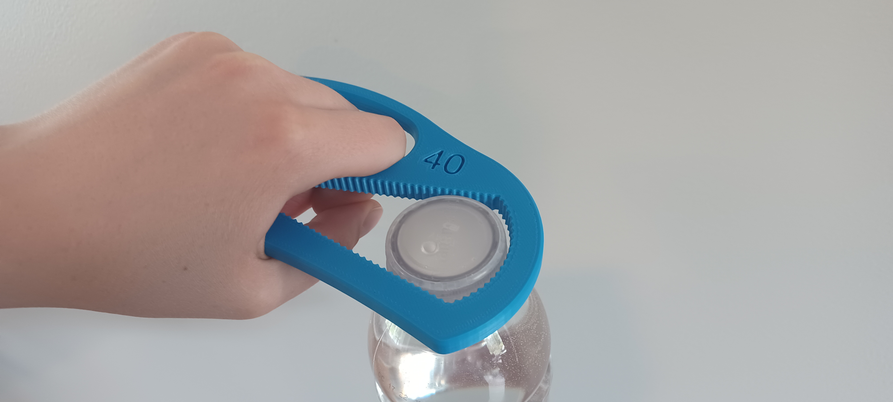

# Bottle Opener
The Bottle Opener is a simple, low-cost, 3D-printable handheld tool to help those with arthritis, limited finger dexterity or other related disabilities open or close plastic screw-on caps on various beverage bottles, cleaning products, condiments. The bottle opener allows users to remove or replace the lids of these jugs with a small squeeze on a large, rounded gripping surface. The Bottle Opener has several modified versions to open different sizes of containers. The different sizes are named by the approximate diameter of the caps they can open in millimeters.

## More info at
- [Makers Making Change Project Page](https://makersmakingchange.com/project/bottle-opener/)

## Getting Started

### 1. Print the 3D Printable components

Print the components according to the instructions in the [3D Print Guide](/Documentation/Bottle_Opener_3D_Print_Guide_V1.0.pdf).

All of the files and individual print files can be in the [/Build_Files](/Build_Files) folder.

### 2. Sizing

There are 5 different sizes of bottle opener to suit the different sizes of plastic caps on various bottles and containers. The [Summary](/Documentation/Bottle_Opener_Summary_V1.0.pdf) contains information on examples of different bottles that can be opened with the different sizes of bottle openers. A [Printable Sizing Sheet](/Documentation/Bottle_Opener_Printable_Sizing_Chart.pdf) has been provided to match bottle caps to the suitable bottle opener. Make sure to check "actual size" in the print settings so the image remains to-scale.

### 3. Bill of Materials

The [Bill of Materials](/Documentation/Bottle_Opener_BOM_V1.0.csv) lists the cost of building the different sizes of Bottle Openers.

## Files
### Documentation
| Document              | Version | Link |
|-----------------------|---------|------|
| Summary               | 1.0     | [Bottle_Opener_Summary](/Documentation/Bottle_Opener_Summary_V1.0.pdf)     |
| 3D Print Guide        | 1.0     | [Bottle_Opener_3D_Print_Guide](/Documentation/Bottle_Opener_3D_Print_Guide_V1.0.pdf)     |
| Design Rationale      | 1.0     | [Bottle_Opener_Design_Rationale](/Documentation/Bottle_Opener_Design_Rationale_V1.0.pdf)     |
| Bill of Materials     | 1.0     | [Bottle_Opener_Bill_of_Materials](/Documentation/Bottle_Opener_BOM_V1.0.csv)     |
| Maker Checklist       | 1.0     | [Bottle_Opener_Maker_Checklist](/Documentation/Bottle_Opener_Maker_Checklist_V1.0.pdf)     |
| User Guide            | 1.0     | [Bottle_Opener_User_Guide](/Documentation/Bottle_Opener_User_Guide_V1.0.pdf)    |
| Changelog             | 1.0     | [Bottle_Opener_Changelog](/Documentation/Bottle_Opener_Changelog_V1.0.pdf)     |
| Printable Sizing Chart| 1.0     | [Bottle_Opener_Printable_Sizing_Chart](/Documentation/Bottle_Opener_Printable_Sizing_Chart.pdf)     |

### Design Files
[CAD Files](/Design_Files)

### Build Files
 - [3D Printing Files](/Build_Files)

## Attribution
Designers:
 - Neil Squire / Makers Making Change

## License
 Bottle Opener by <a xmlns:cc="http://creativecommons.org/ns#" href="www.makersmakingchange.com" property="cc:attributionName" rel="cc:attributionURL">Neil Squire</a> is licensed under a <a rel="license" href="http://creativecommons.org/licenses/by-sa/4.0/">Creative Commons Attribution-ShareAlike 4.0 International License</a>.

---
<!-- ABOUT MMC START -->
## About Makers Making Change

Makers Making Change is a program of [Neil Squire](https://www.neilsquire.ca/), a Canadian non-profit that uses technology, knowledge, and passion to empower people with disabilities.

Makers Making Change leverages the capacity of community based Makers, Disability Professionals and Volunteers to develop and deliver affordable Open Source Assistive Technologies.

 - Website: [www.MakersMakingChange.com](https://www.makersmakingchange.com/)
 - GitHub: [makersmakingchange](https://github.com/makersmakingchange)
 - Bluesky: [@makersmakingchange.bsky.social](https://bsky.app/profile/makersmakingchange.bsky.social)
 - Instagram: [@makersmakingchange](https://www.instagram.com/makersmakingchange)
 - Facebook: [makersmakechange](https://www.facebook.com/makersmakechange)
 - LinkedIn: [Neil Squire Society](https://www.linkedin.com/company/neil-squire-society/)
 - Thingiverse: [makersmakingchange](https://www.thingiverse.com/makersmakingchange/about)
 - Printables: [MakersMakingChange](https://www.printables.com/@MakersMakingChange)

### Contact Us
For technical questions, to get involved, or to share your experience we encourage you to [visit our website](https://www.makersmakingchange.com/) or [contact us](https://www.makersmakingchange.com/s/contact).
<!-- ABOUT MMC END -->
